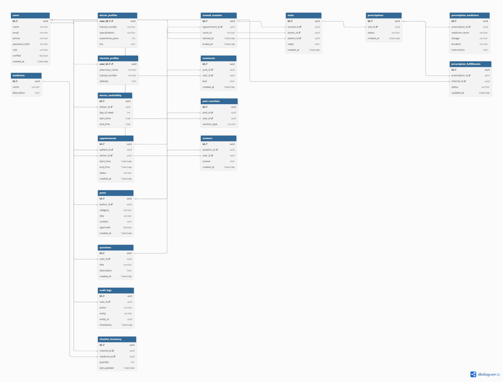

<p align="center">
  
  
  
  
  
  
</p>

# 🏥 CareSphere

**A full-stack telemedicine platform built on a microservices architecture.**

CareSphere connects patients, doctors, and pharmacists through a unified digital healthcare experience — from booking appointments and conducting real-time video consultations to managing prescriptions and pharmacy fulfillment.

---

## Table of Contents

- [Architecture Overview](#architecture-overview)
- [Tech Stack](#tech-stack)
- [Services](#services)
- [Getting Started](#getting-started)
- [Environment Variables](#environment-variables)
- [API Reference](#api-reference)
- [Project Structure](#project-structure)
- [Event-Driven Flows](#event-driven-flows)
- [Frontend](#frontend)
- [ERD](#erd)
- [Contributing](#contributing)
- [License](#license)

---

## Architecture Overview

```
                        ┌──────────────┐
                        │   Frontend   │
                        │  (Next.js)   │
                        └──────┬───────┘
                               │
                               ▼
                      ┌────────────────┐
                      │  API Gateway   │
                      │   :8080        │
                      │ (Spring Cloud) │
                      └───────┬────────┘
                              │
        ┌──────────┬──────────┼──────────┬───────────┬────────────┬────────────┐
        ▼          ▼          ▼          ▼           ▼            ▼            ▼
   ┌─────────┐┌─────────┐┌─────────┐┌──────────┐┌─────────┐┌──────────┐┌─────────┐
   │  Auth   ││ Profile ││  Appt   ││ Consult  ││ Records ││ Pharmacy ││ Content │
   │ :8081   ││ :8082   ││ :8083   ││ :8084    ││ :8085   ││ :8086    ││ :8087   │
   └────┬────┘└────┬────┘└────┬────┘└────┬─────┘└────┬────┘└────┬─────┘└────┬────┘
        │          │          │          │           │          │           │
        ▼          ▼          ▼          ▼           ▼          ▼           ▼
   ┌─────────┐┌─────────┐┌─────────┐┌──────────┐┌─────────┐┌──────────┐┌─────────┐
   │ PG:5432 ││ PG:5433 ││ PG:5434 ││ PG:5435  ││ PG:5436 ││ PG:5437  ││ PG:5438 │
   └─────────┘└─────────┘└─────────┘└──────────┘└─────────┘└──────────┘└─────────┘

                         ┌──────────────┐
                         │    Kafka     │
                         │   (KRaft)   │
                         │    :9092    │
                         └──────────────┘
```

Each backend service owns its own database (**Database-per-Service** pattern) and communicates asynchronously through **Apache Kafka** events, ensuring loose coupling and independent deployability.

---

## Tech Stack

| Layer | Technology |
|---|---|
| **Frontend** | Next.js 16, React 19, TypeScript, Tailwind CSS 4, shadcn/ui |
| **API Gateway** | Spring Cloud Gateway (WebFlux) |
| **Backend Services** | Spring Boot 3.2.4, Java 21, Spring Data JPA |
| **Authentication** | JWT (HMAC-SHA256) via jjwt 0.12.5 |
| **Real-Time** | WebSocket + STOMP (SockJS fallback) |
| **Message Broker** | Apache Kafka 7.6.1 (KRaft mode — no Zookeeper) |
| **Database** | PostgreSQL 16 (one instance per service) |
| **Containerization** | Docker, Docker Compose |
| **Build Tool** | Maven 3.9 (backend), npm (frontend) |

---

## Services

### API Gateway — `:8080`

The single entry point for all client requests. Routes traffic to downstream microservices and enforces JWT authentication via a global filter.

- **Routing**: Path-based routing to all 7 backend services
- **Security**: JWT validation filter (skips `/api/auth/register`, `/api/auth/login`)
- **CORS**: Configured for cross-origin frontend access
- **Logging**: Request/response logging filter

### Auth Service — `:8081`

Handles user identity, registration, login, and JWT token issuance.

- **Roles**: `PATIENT`, `DOCTOR`, `CHEMIST`, `ADMIN`
- **Security**: Spring Security + BCrypt password hashing
- **Events**: Publishes `user-created` events to Kafka on registration
- **Endpoints**: Register, Login, Get Current User, Verify User, Batch User Lookup

### Profile Service — `:8082`

Manages role-specific profiles (Doctor, Chemist) and doctor availability schedules.

- **Kafka Consumer**: Listens for `user-created` events to auto-create profile stubs
- **Doctor Profiles**: Specialization, qualifications, experience, consultation fee
- **Chemist Profiles**: Pharmacy name, license number
- **Availability**: Doctors can set day-of-week + time-slot availability

### Appointment Service — `:8083`

Manages the appointment lifecycle between patients and doctors.

- **Status Machine**: `BOOKED` → `CONFIRMED` → `COMPLETED` / `CANCELLED`
- **Overlap Detection**: Prevents double-booking for the same time slot
- **Events**: Publishes appointment events to Kafka (consumed by Consultation Service)

### Consultation Service — `:8084`

Provides real-time video consultation sessions via WebSocket signaling.

- **WebSocket/STOMP**: Signaling server for WebRTC peer-to-peer connections
- **Session Management**: Creates consultation rooms from confirmed appointments
- **Idempotency**: Returns existing active session if one already exists for an appointment
- **Events**: Publishes `consult-started` / `consult-ended` events to Kafka

### Records Service — `:8085`

Manages patient visit records and prescriptions created during consultations.

- **Visits**: Doctor creates a visit record with diagnosis and notes
- **Prescriptions**: Linked to visits, containing one or more medicines with dosage/frequency
- **Kafka Consumer**: Listens for consultation events to auto-create visit stubs
- **Events**: Publishes prescription events (consumed by Pharmacy Service)

### Pharmacy Service — `:8086`

Handles chemist inventory management and prescription fulfillment workflows.

- **Inventory**: Chemists manage their medicine stock (name, quantity, price, expiry)
- **Fulfillment**: Processes incoming prescriptions and tracks fulfillment status
- **Kafka Consumer**: Listens for prescription events to auto-create fulfillment requests
- **Status Machine**: `PENDING` → `IN_PROGRESS` → `FULFILLED` / `REJECTED`

### Content Service — `:8087`

Powers the community/social features — posts, Q&A, comments, and reactions.

- **Posts**: Doctors publish health articles with reactions (LIKE, HELPFUL, INSIGHTFUL)
- **Q&A**: Patients ask health questions, doctors answer
- **Comments**: Threaded comments on posts
- **Role Guard**: Only doctors can create posts; any authenticated user can interact

---

## Getting Started

### Prerequisites

- **Docker** & **Docker Compose** v2+
- **Git**

### Quick Start

```bash
# 1. Clone the repository
git clone https://github.com/Adipatil7/CareSphere.git
cd CareSphere

# 2. Build and start all services
docker compose -f infrastructure/docker-compose.yml up --build -d

# 3. Verify all containers are running
docker compose -f infrastructure/docker-compose.yml ps
```

> **Note:** The first build may take several minutes as Maven downloads dependencies for all 8 Java services. Dockerfiles include automatic retry logic for resilience against transient network issues.

### Running the Frontend Locally

```bash
cd frontend
npm install
npm run dev
```

The frontend will be available at **http://localhost:3000** and proxies API calls to the gateway at `http://localhost:8080`.

### Stopping the Stack

```bash
docker compose -f infrastructure/docker-compose.yml down

# To also remove persistent volumes (databases):
docker compose -f infrastructure/docker-compose.yml down -v
```

---

## Environment Variables

All services are pre-configured via `docker-compose.yml` environment blocks. Key variables:

| Variable | Default | Description |
|---|---|---|
| `SPRING_DATASOURCE_URL` | `jdbc:postgresql://<svc>-db:5432/<svc>_db` | JDBC connection string |
| `SPRING_DATASOURCE_USERNAME` | `postgres` | Database username |
| `SPRING_DATASOURCE_PASSWORD` | `postgres` | Database password |
| `SPRING_KAFKA_BOOTSTRAP_SERVERS` | `kafka:9092` | Kafka broker address |
| `jwt.secret` | *(set in gateway config)* | HMAC-SHA256 signing key |

---

## API Reference

All endpoints are accessed through the API Gateway at `http://localhost:8080`.

### Auth (`/api/auth`)

| Method | Endpoint | Auth | Description |
|---|---|---|---|
| `POST` | `/api/auth/register` | ✗ | Register a new user |
| `POST` | `/api/auth/login` | ✗ | Authenticate and receive JWT |
| `GET` | `/api/auth/me` | ✓ | Get current authenticated user |
| `POST` | `/api/auth/verify` | ✓ | Verify a user account |
| `GET` | `/api/auth/users/{id}` | ✓ | Get user by ID |
| `POST` | `/api/auth/users/batch` | ✓ | Batch resolve user IDs to names |

### Profiles (`/api/profiles`)

| Method | Endpoint | Auth | Description |
|---|---|---|---|
| `GET` | `/api/profiles/doctors` | ✓ | List/search doctors |
| `GET` | `/api/profiles/doctors/{userId}` | ✓ | Get doctor profile |
| `PUT` | `/api/profiles/doctors/{userId}` | ✓ | Update doctor profile |
| `GET` | `/api/profiles/chemists/{userId}` | ✓ | Get chemist profile |
| `PUT` | `/api/profiles/chemists/{userId}` | ✓ | Update chemist profile |
| `GET` | `/api/profiles/doctors/{id}/availability` | ✓ | Get doctor availability |
| `PUT` | `/api/profiles/doctors/{id}/availability` | ✓ | Set doctor availability |

### Appointments (`/api/appointments`)

| Method | Endpoint | Auth | Description |
|---|---|---|---|
| `POST` | `/api/appointments` | ✓ | Book an appointment |
| `GET` | `/api/appointments/patient/{patientId}` | ✓ | List patient's appointments |
| `GET` | `/api/appointments/doctor/{doctorId}` | ✓ | List doctor's appointments |
| `PATCH` | `/api/appointments/{id}/status` | ✓ | Update appointment status |

### Consultations (`/api/consultations`)

| Method | Endpoint | Auth | Description |
|---|---|---|---|
| `POST` | `/api/consultations/start` | ✓ | Start a consultation session |
| `POST` | `/api/consultations/{roomId}/end` | ✓ | End a consultation session |

**WebSocket**: `ws://localhost:8084/ws` (STOMP over SockJS)

### Records (`/api/records`)

| Method | Endpoint | Auth | Description |
|---|---|---|---|
| `POST` | `/api/records/visits` | ✓ | Create a visit record |
| `GET` | `/api/records/visits/patient/{patientId}` | ✓ | Get patient's visit history |
| `POST` | `/api/records/prescriptions` | ✓ | Create a prescription |
| `GET` | `/api/records/prescriptions/patient/{patientId}` | ✓ | Get patient's prescriptions |

### Pharmacy (`/api/pharmacy`)

| Method | Endpoint | Auth | Description |
|---|---|---|---|
| `POST` | `/api/pharmacy/inventory` | ✓ | Add inventory item |
| `GET` | `/api/pharmacy/inventory/chemist/{chemistId}` | ✓ | List chemist's inventory |
| `PUT` | `/api/pharmacy/inventory/{id}` | ✓ | Update inventory item |
| `DELETE` | `/api/pharmacy/inventory/{id}` | ✓ | Delete inventory item |
| `GET` | `/api/pharmacy/fulfillments/chemist/{chemistId}` | ✓ | List fulfillment requests |
| `PATCH` | `/api/pharmacy/fulfillments/{id}/status` | ✓ | Update fulfillment status |

### Content (`/api/content`)

| Method | Endpoint | Auth | Description |
|---|---|---|---|
| `POST` | `/api/content/posts` | ✓ | Create a post (doctors only) |
| `GET` | `/api/content/posts` | ✓ | List all posts |
| `POST` | `/api/content/posts/{id}/comments` | ✓ | Add a comment |
| `POST` | `/api/content/posts/{id}/reactions` | ✓ | React to a post |
| `POST` | `/api/content/questions` | ✓ | Ask a question |
| `GET` | `/api/content/questions` | ✓ | List all questions |
| `POST` | `/api/content/questions/{id}/answers` | ✓ | Answer a question |

---

## Project Structure

```
CareSphere/
├── api-gateway/                    # Spring Cloud Gateway
│   └── src/main/java/.../gateway/
│       ├── config/CorsConfig
│       ├── filter/JwtAuthenticationFilter
│       └── filter/LoggingFilter
│
├── auth-service/                   # Authentication & user management
│   └── src/main/java/.../auth/
│       ├── controller/AuthController
│       ├── entity/{User, Role}
│       ├── security/{JwtUtil, JwtAuthenticationFilter}
│       ├── kafka/AuthEventProducer
│       └── service/AuthService
│
├── profile-service/                # Doctor & chemist profiles
│   └── src/main/java/.../profile/
│       ├── controller/{ProfileController, DoctorAvailabilityController}
│       ├── entity/{DoctorProfile, ChemistProfile, DoctorAvailability}
│       ├── kafka/UserCreatedEventConsumer
│       └── service/{ProfileService, DoctorAvailabilityService}
│
├── appointment-service/            # Appointment booking & scheduling
│   └── src/main/java/.../appointment/
│       ├── controller/AppointmentController
│       ├── entity/{Appointment, AppointmentStatus}
│       ├── kafka/AppointmentEventProducer
│       └── service/AppointmentService
│
├── consultation-service/           # Real-time video consultations
│   └── src/main/java/.../consultation/
│       ├── controller/ConsultationController
│       ├── websocket/{WebSocketConfig, SignalingController}
│       ├── kafka/{AppointmentEventConsumer, ConsultEventProducer}
│       └── service/ConsultationService
│
├── records-service/                # Visit records & prescriptions
│   └── src/main/java/.../records/
│       ├── controller/{VisitController, PrescriptionController}
│       ├── entity/{Visit, Prescription, PrescriptionMedicine}
│       ├── kafka/{ConsultEventConsumer, RecordsEventProducer}
│       └── service/{VisitService, PrescriptionService}
│
├── pharmacy-service/               # Inventory & prescription fulfillment
│   └── src/main/java/.../pharmacy/
│       ├── controller/{InventoryController, FulfillmentController}
│       ├── entity/{Medicine, ChemistInventory, PrescriptionFulfillment}
│       ├── kafka/{PrescriptionEventConsumer, PharmacyEventProducer}
│       └── service/{InventoryService, FulfillmentService}
│
├── content-service/                # Community posts, Q&A, comments
│   └── src/main/java/.../content/
│       ├── controller/{PostController, QuestionController}
│       ├── entity/{Post, Comment, PostReaction, Question, Answer}
│       └── service/{PostService, QuestionService}
│
├── frontend/                       # Next.js client application
│   └── src/
│       ├── app/                    # App Router pages
│       │   ├── (auth)/{login, register}
│       │   ├── patient/{dashboard, appointments, doctors, consult, records, pharmacy, community}
│       │   ├── doctor/{dashboard, appointments, consult, records, community}
│       │   ├── chemist/{dashboard, inventory, fulfill}
│       │   ├── profile/
│       │   └── settings/
│       ├── components/{common, layout, ui}
│       ├── hooks/
│       ├── services/               # API client modules
│       ├── types/
│       ├── lib/
│       └── middleware.ts           # JWT auth + role-based route guard
│
├── infrastructure/
│   └── docker-compose.yml          # Full stack orchestration
│
└── ERD-CareSphere.png              # Entity-Relationship Diagram
```

---

## Event-Driven Flows

CareSphere uses Kafka topics to orchestrate workflows across service boundaries:

```
┌──────────┐  user-created   ┌─────────────┐
│   Auth   │ ──────────────► │   Profile   │  Auto-creates doctor/chemist profile stub
└──────────┘                 └─────────────┘

┌──────────────┐  appointment-events  ┌──────────────┐
│ Appointment  │ ───────────────────► │ Consultation │  Enables "Start Consult" for confirmed appts
└──────────────┘                      └──────────────┘

┌──────────────┐  consult-events  ┌──────────┐
│ Consultation │ ───────────────► │ Records  │  Auto-creates visit stub on consult start
└──────────────┘                  └──────────┘

┌──────────┐  prescription-events  ┌──────────┐
│ Records  │ ────────────────────► │ Pharmacy │  Creates fulfillment request for chemists
└──────────┘                       └──────────┘
```

---

## Frontend

The frontend is a **Next.js 16** application using the **App Router**, **React 19**, **TypeScript**, and **Tailwind CSS 4** with **shadcn/ui** components.

### Key Features

- **Role-Based Routing**: Middleware enforces that patients, doctors, and chemists can only access their respective dashboards
- **JWT Authentication**: Token stored in cookies, decoded client-side for role detection
- **Real-Time Consultation**: WebRTC video calls with STOMP/WebSocket signaling
- **Responsive Design**: Mobile-friendly layouts across all views

### Role Dashboards

| Role | Routes | Features |
|---|---|---|
| **Patient** | `/patient/*` | Dashboard, browse doctors, book appointments, join consultations, view records, pharmacy, community |
| **Doctor** | `/doctor/*` | Dashboard, manage appointments, conduct consultations, create records/prescriptions, community |
| **Chemist** | `/chemist/*` | Dashboard, manage inventory, fulfill prescriptions |

---

## ERD

The Entity-Relationship Diagram for CareSphere is available in the repository root:



---

## Contributing

1. **Fork** the repository
2. **Create** your feature branch (`git checkout -b feature/amazing-feature`)
3. **Commit** your changes (`git commit -m 'Add amazing feature'`)
4. **Push** to the branch (`git push origin feature/amazing-feature`)
5. **Open** a Pull Request

---

## License

This project is open source and available under the [MIT License](LICENSE).

---

<p align="center">
  Built with ❤️ by the CareSphere team
</p>
